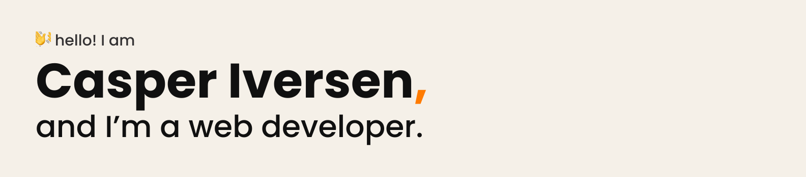

##

I'm a passionate software engineer based in Belgium, driven to craft accessible, responsive, and high-performance code.
I've been immersed in web development for about 5 years and constantly exploring endless learning opportunities and challenging myself to grow.

## 

<a href="https://casperiv.dev">website</a> － <a href="https://snailycad.org">SnailyCAD</a> － <a href="https://linkedin.com/in/casper-iversen">LinkedIn</a>

